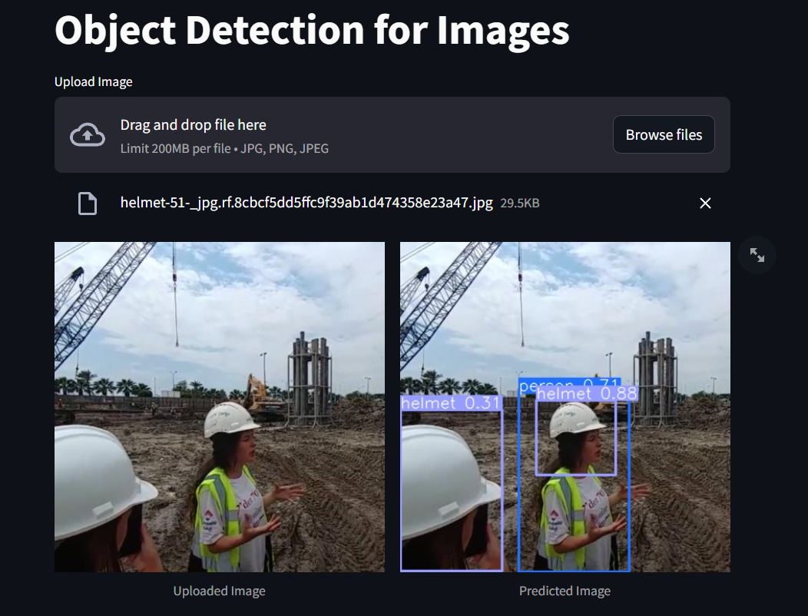

# YOLOv10 Helmet Safety Detection

This repository contains a YOLOv10-based helmet safety detection project. The model is trained to detect helmets in images, and you can deploy the detection system using Streamlit.

## Project Structure

```plaintext
YOLOv10-Helmet-Safety-Detection/
├── assets/
│   ├── image_1.jpg
│   ├── image_2.jpg
│   ├── pred_image_1.jpg
│   └── pred_image_2.jpg
├── models/
│   └── best.pt
├── source/
│   ├── Demo_YOLOv10_Helmet_Safety_Detection.ipynb
│   ├── deploy.py
│   └── Yolov10_Helmet_Safety_Detection.ipynb
├── yolov10/
├── .gitignore
├── LICENSE
└── README.md
```
## Directory Structure

- `assets`: Directory containing sample images and prediction results.

- `models`: Directory containing the trained YOLOv10 model.

- `source`: Directory containing Jupyter notebooks and the Streamlit deployment script.

- `yolov10`: YOLOv10 model code (assumed to be cloned from the YOLOv10 GitHub repository).

- `deploy.py`: Script for deploying the model with Streamlit.

## Installation
1. Clone the Repository
   ```bash
   git clone https://github.com/lbnm203/YOLOv10-Helmet-Safety-Detection.git

   cd YOLOv10-Helmet-Safety-Detection
   ```

2. Navigate to the `yolov10` folder.
   ```bash
   cd yolov10
   ```

3. Open a terminal and run the following command:
   ```bash
   pip install .
   ```

4. Install required package
   ```bash
   pip install -r yolov10/requirements.txt
   pip install streamlit
   pip install opencv-python-headless
   pip install pillow
   ```

## Deployment
To deploy the YOLOv10 Helmet Safety Detection model using Streamlit, run the following command:
   ```bash
   streamlit run ./source/deploy.py
   ```

## Demo 
<p align = 'center'>
   
</p>

## License
This project is licensed under the MIT License. See the LICENSE file for details.

## Acknowledgments
- [YOLOv10](https://github.com/THU-MIG/yolov10) for the base model implementation.


### Notes:
- Update the installation instructions if there are any additional dependencies specific to your project.

This README provides a comprehensive guide for users to install dependencies, run the application, and understand the project structure.
